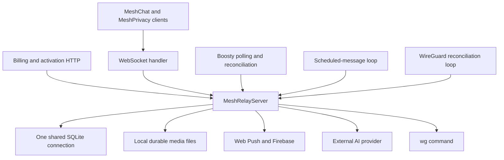

# MeshChat server architecture review

Date: 2026-07-23  
Scope: step 1 of the server decomposition plan. This document describes the
current server without changing its runtime behavior.

## Baseline

- `python -m unittest discover -s server/tests -v`: 170 passed, 3 skipped.
- The WebSocket relay, HTTP billing endpoint, Boosty bridge, scheduler,
  WireGuard reconciliation, push delivery, AI integration, Sync v2, media
  persistence, and account management run in one Python process.
- The process owns one SQLite connection and 41 application tables.
- Sync v2 already provides operation IDs, mutation ACKs, tombstones, durable
  cursors, snapshot fallback, and an event journal.
- Verified SQLite backups, health checks, media audits, and reliability tests
  already exist.

These are useful foundations. The goal is not a rewrite: preserve the tested
protocol and move responsibilities behind explicit interfaces.

## Current topology



`MeshRelayServer` is assembled from eleven mixins. The files look modular, but
all mixins share `self.db`, connection maps, configuration, and each other's
methods. The boundaries are therefore organizational rather than ownership
boundaries.

## Findings

### P1: persistence has no ownership boundary

`server_storage.py` contains 61 functions and 5,513 lines. It creates the full
schema, performs startup migrations, stores every chat-domain mutation, owns
media files, push tokens, profile preferences, and some MeshPro usage data.
Eight other server modules execute SQL directly against `self.db`.

The account-deletion routine contains a manual list of nearly every table. A
new table can therefore be added successfully but accidentally omitted from
account deletion, backup validation, or a future migration.

Impact:

- PostgreSQL migration cannot be isolated to one adapter.
- Domain code depends on SQLite SQL and transaction behavior.
- Data retention and deletion rules are difficult to prove complete.
- Independent services cannot own or evolve their schemas safely.

### P1: blocking work runs on the WebSocket event loop

SQLite queries, password hashing, media encoding and file operations,
WireGuard subprocess calls, and Web Push delivery are synchronous. Web Push
can block for up to five seconds per endpoint. The scheduler also wakes every
second in the same process.

Impact:

- A slow disk, provider, password verification, or push endpoint can delay
  unrelated messages and call signaling.
- Adding more process replicas is not possible while connections and SQLite
  ownership remain local to one process.

### P1: one process is the failure and scaling boundary

The process contains:

- authenticated WebSocket sessions and live fanout;
- Sync v2 snapshots, deltas, offline delivery, and mutation persistence;
- call signaling;
- billing HTTP callbacks and checkout pages;
- Boosty Telegram polling and reconciliation;
- scheduled messages;
- WireGuard provisioning and reconciliation;
- push delivery and AI calls.

An unhandled failure or resource spike in an auxiliary integration can affect
chat delivery. In-memory `clients`, `client_logins`, capability maps, and
service sessions also make horizontal relay scaling unsafe without a shared
presence/fanout layer.

### P1: SQLite constraints are declared but not enabled

The schema declares several `FOREIGN KEY ... ON DELETE CASCADE` constraints,
but `open_db()` does not execute `PRAGMA foreign_keys=ON`. SQLite disables
foreign-key enforcement by default, so those cascades and integrity checks are
not active on the runtime connection.

Do not simply enable this in production. First run `foreign_key_check`, repair
existing violations, and add tests around every intended cascade.

### P2: the transport handler is also the application service

`MeshRelayServer.handler()` performs handshake negotiation, authentication,
email 2FA, capability rollout, request validation, AI requests, subscription
operations, profile/device changes, scheduling, persistence, ACK generation,
fanout, offline storage, and push dispatch. Durable mutation handling later
funnels into a second large type switch in `save_history_packet()`.

Impact:

- Adding a packet type requires editing central dispatch code.
- Authorization, persistence, and delivery ordering are easy to couple.
- Unit tests need a mostly complete relay object even for narrow behavior.

### P2: transaction behavior is tied to one shared connection

`atomic_storage_transaction()` tracks nesting depth on the relay object. The
current mutation path is synchronous inside the transaction, so the existing
tests pass, but this contract is fragile: a future `await`, thread, or second
connection can make transaction ownership ambiguous.

The PostgreSQL version must use request-scoped transactions supplied by a
repository/unit-of-work boundary, never global transaction depth.

### P2: schema migration is part of normal startup

`open_db()` creates tables, inspects columns, runs ad-hoc `ALTER TABLE`
statements, migrates legacy tables, and performs housekeeping before serving.
There is no explicit schema-version ledger or independently executable,
reversible migration sequence.

Impact:

- Startup duration and failure modes grow with the schema.
- Two future replicas could race migrations.
- Deployment rollback cannot reason about schema compatibility precisely.

### P2: call signaling is coupled to device-local presence

Call packets are detected by a string prefix and routed directly through the
relay's in-memory client map. This is adequate for one relay process, but it is
not a durable call service and cannot coordinate multiple relay replicas,
TURN credentials, or SFU rooms.

Calls are the best first physical extraction after the modular monolith and
PostgreSQL work. Chat/Sync should not be physically split first.

### P2: observability is mainly textual output

Runtime paths use `print()` for lifecycle information and failures. Health and
reliability JSON reports exist, but there are no structured per-operation logs,
latency histograms, queue-depth metrics, or trace/correlation IDs spanning
persist, ACK, fanout, push, and sync.

## Proposed data ownership

| Domain | Authoritative data |
| --- | --- |
| Identity | accounts, account devices, trusted email devices, auth challenges |
| Chat/Sync | direct messages, groups, members, keys, messages, deletes, reactions, pins, stories, event journal, cursors, processed mutations, offline queue |
| Media | stored files, transfer sessions, chunks, durable media paths and hashes |
| Subscription/Billing | subscriptions, events, orders, Boosty links/codes/recipients, MeshPro usage |
| Push | Web Push subscriptions and Android tokens |
| VPN | service sessions and WireGuard peers |
| Automation | scheduled messages |
| AI | AI usage reservations and cached transcription/OCR results |

Cross-domain writes must go through a service command, not a direct SQL query.
Account deletion should become an orchestrated workflow where every owner
implements an explicit deletion/retention contract.

## Step 2 target: modular monolith

Keep one deployable process initially, but introduce these boundaries:

```text
server/
  bootstrap.py
  transport/
    websocket.py
    billing_http.py
    protocol.py
  application/
    command_bus.py
    mutation_pipeline.py
  domains/
    identity/
    chat_sync/
    media/
    subscriptions/
    push/
    vpn/
    automation/
    ai/
  persistence/
    database.py
    unit_of_work.py
    repositories/
  workers/
    boosty.py
    scheduled_messages.py
    wireguard.py
```

This is a boundary map, not a requirement to move every file at once.

### Safe extraction order inside step 2

1. Add a packet command registry while preserving every existing packet name
   and response.
2. Wrap the SQLite connection in a request-scoped unit-of-work interface.
3. Extract repositories in this order: identity, subscription, chat/sync,
   media, then auxiliary integrations.
4. Move permission checks and mutation persistence into application services.
5. Make the WebSocket handler responsible only for handshake, decoding,
   dispatch, ACK serialization, and connection lifecycle.
6. Move periodic loops behind worker classes with explicit start/stop methods.

### Step 2 implementation progress

- The WebSocket entrypoint now delegates handshake, connection lifecycle,
  mutation preparation/execution, transport helpers, protocol constants, and
  worker lifecycle to focused modules.
- Packet dispatch is composed from identity, subscription, push, automation,
  sync/media, and AI command modules. The compatibility facade preserves all
  27 regular and 8 control packet registrations.
- Persistence now exposes `IdentityRepository`, `SubscriptionRepository`,
  `UnitOfWork`, and `UnitOfWorkFactory` contracts plus SQLite adapters.
  Registration, login, password changes, email verification challenges,
  trusted email devices, account devices, public profile reads/writes,
  MeshPro grants/revocations/provider leases, subscription events, legacy
  entitlement canonicalization, service sessions, Boosty recipients,
  activation codes, atomic redemption, and reconciliation state now cross
  that boundary.
- Account deletion is now a cross-domain orchestrated workflow. Identity,
  Chat/Sync, Media, Subscription, VPN, AI, Push, and Automation declare an
  authoritative deletion or release policy for every account-scoped table.
  Database changes share one transaction; durable files are removed only
  after commit. Schema-driven tests fail when a new account-linked table has
  no owner or when two owners claim the same table.
- The remaining storage methods still use the shared SQLite connection. They
  should move repository by repository; introducing PostgreSQL before those
  ownership boundaries are covered by tests would only relocate coupling.

### Step 2 completion

Step 2 is complete as a modular-monolith extraction. The deployed shape is
still one Python process and the wire protocol is unchanged, while:

- `server.py` is now a composition root and contains no application SQL;
- transport, connection, command, mutation, protocol, and worker modules have
  explicit responsibilities and architecture tests prevent SQL from leaking
  into them;
- packet commands are registered by domain rather than appended to the
  WebSocket handler;
- identity and subscription workflows use repository/unit-of-work contracts;
- account deletion is an orchestrated cross-domain transaction with an
  exhaustive ownership registry;
- periodic integrations have explicit lifecycle supervision;
- SQLite-specific schema, migrations, and the remaining legacy query methods
  are deliberately concentrated in `server_storage.py` and
  `server/persistence/`.

Billing, VPN, automation, Chat/Sync, and media still have SQLite implementations
inside that persistence boundary. Turning each of those query groups into
PostgreSQL repository adapters is the first migration slice of step 3, not a
second deployment or a protocol rewrite.

## Step 2 acceptance gates

- The full server regression suite remains green.
- No packet names, capability flags, ACK ordering, or Sync v2 envelopes change.
- Snapshot and delta shadow comparison remains equal.
- A duplicate operation remains idempotent across two devices.
- Account deletion has a registry of participating data owners and a test that
  fails when a new account-scoped table has no policy.
- Transport modules contain no SQL.
- Domain services do not access `clients` directly; delivery uses a gateway.
- Repository methods receive an explicit unit of work.
- Existing SQLite deployment remains supported until PostgreSQL step 3.

## Step 2 implementation status

The first extraction slice is complete without changing deployment or the
wire protocol:

- `server_protocol.py` owns protocol versions, compatibility helpers, socket
  limits, and packet fan-out constants.
- `server_transport.py` owns ACK/error serialization, routing, completed file
  delivery, and same-account live fan-out. It contains no SQL.
- `server_workers.py` owns explicit start/stop lifecycle for Boosty, billing
  HTTP, WireGuard reconciliation, and scheduled-message maintenance.
- `server_commands.py` introduces an incremental packet command registry and
  immutable connection context. MeshPro catalog, push registration,
  subscription status, all AI requests, profile lookup/update, account device
  management, password changes, push removal, scheduled messages, email
  binding, account deletion, Sync ACK/snapshot control, File Transfer v2,
  billing/VPN service commands, and preference updates now dispatch through
  explicit control and mutation-aware phases. Unsupported File Transfer v2
  packets deliberately fall through to the legacy protocol path.
- `server_connection.py` owns protocol/token checks, account and service
  handshake, capability negotiation, initial-sync preparation, and guarded
  disconnect cleanup. Runtime auth settings are passed in explicitly so the
  existing entrypoint and rollout controls remain unchanged.
- `server_mutations.py` owns mutation idempotency preflight, group-management
  authorization, identity enrichment, atomic history/Sync v2 persistence,
  mutation ACKs, same-account fan-out, and final destination routing.
- `server.py` remains the deployment entrypoint and continues to re-export
  protocol symbols used by existing tests and tooling.
- Architecture tests protect the no-SQL transport/command boundary and worker
  lifecycle. Connection tests also protect replacement-socket cleanup from
  taking a newer session offline. Mutation tests cover duplicate operations,
  authorization failures, identity normalization, rejected writes, and group
  deletion fan-out. Command tests protect service identity, account deletion
  termination, email binding, Sync control, and File Transfer v2 fallback.
  The full server regression suite remains green.

`MeshRelayServer.handler` is now connection validation plus two-phase command
dispatch and the mutation pipeline. The command catalog is split by domain,
and the first complete repository paths now cover identity, the core
  subscription lifecycle, and Boosty activation state. Account deletion also
  has explicit owner contracts and rollback tests. Step 2 is complete. The next
safe slice is a PostgreSQL-compatible Billing repository, while keeping payment
provider network verification in its application service, followed by VPN,
Automation, Chat/Sync, and Media repositories.

## Physical extraction order

After the modular monolith and PostgreSQL migration:

1. Call signaling plus coturn credentials.
2. Background workers for Boosty, scheduled messages, push, and WireGuard.
3. Media upload/processing and object storage.
4. Re-evaluate Chat/Sync extraction using production metrics.

Do not make the database a generic remote "database service". PostgreSQL is
infrastructure; each application service should own repositories and data
contracts. Splitting Chat and Sync before those contracts exist would create a
distributed monolith with harder failure modes.

## Eight-step sequence

1. Review dependencies, loops, handlers, and data ownership. **Completed by
   this document.**
2. Split the Python server into explicit modules without changing deployment.
3. Migrate SQLite to PostgreSQL.
4. Extract calls and configure coturn.

Call signaling now has an explicit domain boundary in `server_calls.py`.
The relay can issue short-lived coturn REST credentials and old clients retain
their STUN fallback. Production coturn provisioning and cross-network relay
verification remain deployment steps; see `CALLS.md`.
5. Extract background workers.
6. Separate media upload and processing.
7. Decide from metrics whether Chat/Sync needs physical separation.
8. Add complete metrics, structured logs, health checks, and automated backups
   for every resulting service.

## Step 3 implementation status

**Implementation complete; production cutover remains an operator action.**

PostgreSQL now has ordered, ledger-backed migrations for every MeshChat server
table, a runtime backend switch, compatibility-backed identity/subscription
repositories, the native Billing repository, and transaction-aware Unit of
Work factories. Chat/Sync, media, automation, VPN, account, and auxiliary
storage paths run against the PostgreSQL backend without changing the network
protocol.

The resumable SQLite copy command preserves primary keys, resets identity
sequences, and records per-table progress. Verification compares exact row
counts and normalized SHA-256 fingerprints. A dedicated cutover preflight also
requires SQLite integrity and every checked-in PostgreSQL migration.

Real PostgreSQL WebSocket tests cover direct history/deletion, Sync v2 delta,
group ownership/membership, channel history/files/reactions/leave, resumable
file transfer, sticker libraries, and reaction deduplication. SQLite remains
the default and its full regression suite remains mandatory. See
`POSTGRES_MIGRATION.md` for the maintenance cutover and rollback boundary.
